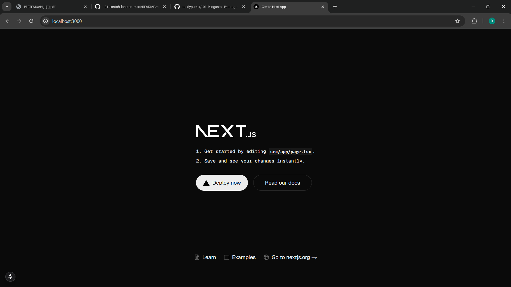

This is a [Next.js](https://nextjs.org) project bootstrapped with [`create-next-app`](https://nextjs.org/docs/app/api-reference/cli/create-next-app).

## Getting Started

First, run the development server:

```bash
npm run dev
# or
yarn dev
# or
pnpm dev
# or
bun dev
```

Open [http://localhost:3000](http://localhost:3000) with your browser to see the result.

You can start editing the page by modifying `app/page.tsx`. The page auto-updates as you edit the file.

This project uses [`next/font`](https://nextjs.org/docs/app/building-your-application/optimizing/fonts) to automatically optimize and load [Geist](https://vercel.com/font), a new font family for Vercel.

## Learn More

To learn more about Next.js, take a look at the following resources:

- [Next.js Documentation](https://nextjs.org/docs) - learn about Next.js features and API.
- [Learn Next.js](https://nextjs.org/learn) - an interactive Next.js tutorial.

You can check out [the Next.js GitHub repository](https://github.com/vercel/next.js) - your feedback and contributions are welcome!

## Deploy on Vercel

The easiest way to deploy your Next.js app is to use the [Vercel Platform](https://vercel.com/new?utm_medium=default-template&filter=next.js&utm_source=create-next-app&utm_campaign=create-next-app-readme) from the creators of Next.js.

Check out our [Next.js deployment documentation](https://nextjs.org/docs/app/building-your-application/deploying) for more details.

## Laporan Praktikum

|       | Pemrograman Berbasis Framework 2025 |
| ----- | ----------------------------------- |
| NIM   | 2241720124                          |
| Nama  | Rendy Putra Kusuma                  |
| Kelas | TI - 3A                             |

### Pertanyaan Praktikum 1

1.  Jelaskan kegunaan masing-masing dari Git, VS Code dan NodeJS yang telah Anda install
    pada sesi praktikum ini!

        Jawaban:

        Git berfungsi untuk mengelola perubahan kode dalam proyek, melacak perubahan kode, membantu menggabungkan kode dari beberapa orang dalam proyek sehingga bisa mengerjakan proyek secara kolaboratif

        VS Code berfungsi sebagai kode editor

        NodeJS berfungsi untuk menjalankan JavaScript di server dan membuat JavaScript bisa digunakan untuk backend development

2.  Buktikan dengan screenshoot yang menunjukkan bahwa masing-masing tools tersebut
    telah berhasil terinstall di perangkat Anda!


### Pertanyaan Praktikum 2

1.  Pada Langkah ke-2, setelah membuat proyek baru menggunakan Next.js, terdapat beberapa
    istilah yang muncul. Jelaskan istilah tersebut, TypeScript, ESLint, Tailwind CSS, App Router, Import alias, App router, dan Turbopack!

        Jawaban:

        TypeScript adalah bahasa pemrograman berbasis JavaScript yang menambahkan fitur strong-typing dan konsep pemrograman OOP klasik

        ESLint adalah tools JavaScript yang berfungsi untuk memeriksa masalah pada JavaScript dan TypeScript

        Tailwind CSS adalah frameworkd dari CSS yang dipakai untuk kustom desain user interface

        App Router adalah sistem routing berbasis folder di direktori /app

        Import alias adalah sistem yang memungkinkan kita untuk mengimpor dengan path lebih pendek dibandingkan dengan relative path seperti biasanya

        Turbopack adalah incremental bundler NextJS yang dioptimisasi untuk JavaScript dan TypeScript, ditulis dengan Rust. Turbopack berfungsi untuk mempercepat developing aplikasi lokal

2.  Apa saja kegunaan folder dan file yang ada pada struktur proyek React yang tampil pada
    gambar pada tahap percobaan ke-3!

        Jawaban:

        Folder .next menyimpan file hasil kompile, cache dan aset yang dioptimasi Next.js

        Folder node_modules menyimpan library dan dependensi proyek yang diinstall lewat npm

        Folder public menyimpan aset statis seperti gambar, ikon, font atau file yang bisa diakses langsung lewat URL

        Folder src/app merupakan diretori utama untuk routing di Next.js

        .gitignore

        eslint.config.mjs merupakan file konfigurasi untuk ESLint

        next-env.d.ts adalah file deklarasi tipe TypeScript yang dibuat otomatis agar Next.js bisa bekerja lancar dengan TypeScript

        next.config.ts adalah file konfigurasi utama Next.js dalam format TypeScript

        package.json adalah file konfigurasi proyek dan dependensi Node.js

        package-lock.json adalah file otomatis yang dibuat npm untuk mengunci versi dependensi

        postcss.config.mjs merupakan file konfigurasi untuk PostCSS, alat untuk memproses CSS modern

        tailwind.config.ts adalah file konfigurasi buat Tailwind CSS dalam format TypeScript

        tsconfig.json adalah file konfigurasi untuk typescript yang mengatur cara kerja TypeScript di proyek Next.js

3.  Buktikan dengan screenshoot yang menunjukkan bahwa tahapan percobaan di atas telah
    berhasil Anda lakukan!




### Pertanyaan Praktikum 3

1. Buktikan dengan screenshoot yang menunjukkan bahwa tahapan percobaan di atas telah
   berhasil Anda lakukan!


### Pertanyaan Praktikum 4

1.  Untuk apakah kegunaan sintaks user.imageUrl?

        Jawaban:

        Untuk memanggil imageUrl yang sudah dideklarasikan pada const user

2.  Buktikan dengan screenshoot yang menunjukkan bahwa tahapan percobaan di atas telah
    berhasil Anda lakukan!


